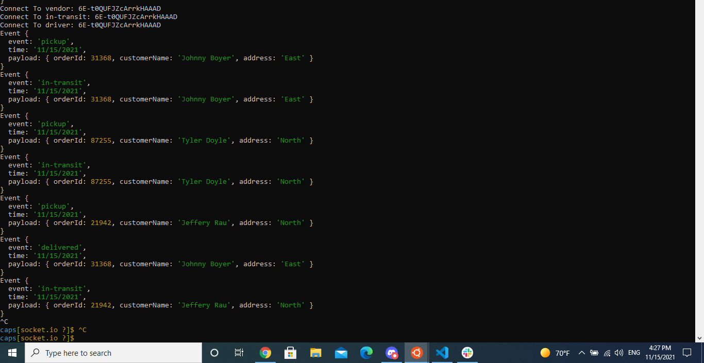
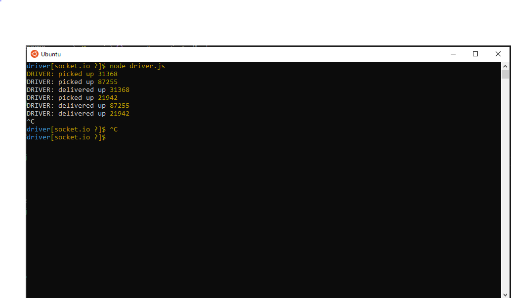
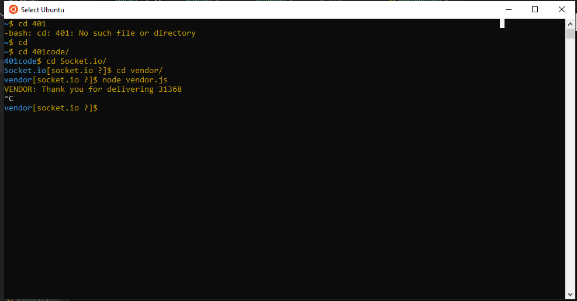
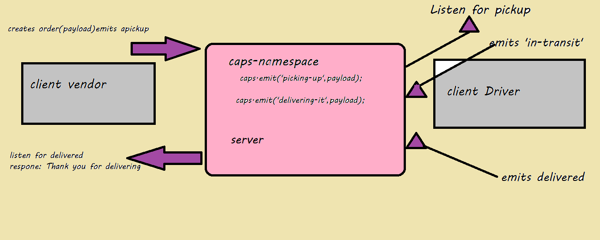

# Lab: Class 12

## caps-socket.io

### Author: Samah Hamed

### Setup
- .env requirements
  - STORE_NAME = 
  - PORT = 

### Running the app
- cd to caps
     - node caps.js
- cd to vendore
     - node vendore.js
  - cd to driver
     - node driver.js

    - Returns Object

    
    
    

### Tests
- Unit Tests: npm run test

### UML

### Notes
- pull request : https://github.com/samahhamed227/Socket.io
- How do I install the app or library?
  - Clone the repo to your local machine
  - in the terminal, `run npm i`
  - Create `.env` file with port name 
  - run node caps.js  
  - run node vendor.js and node driver.js in another terminal windows to see the  return result  

- How do I test the app or library?
1.  in the termenal run `node caps.js`
2.   in the termenal run `node vendor.js`
3.   in the termenal run `node driver.js`